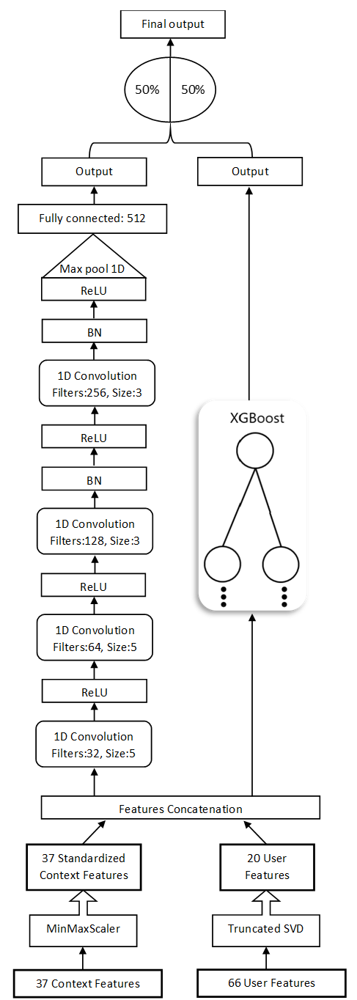
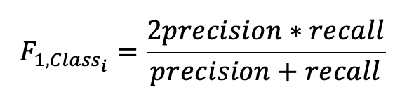
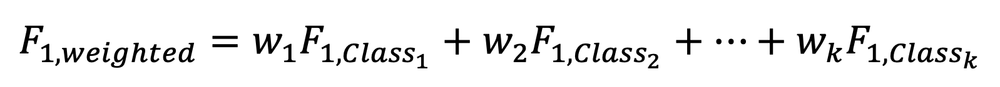

# MTRecS-DLT: Multi-Modal Transport Recommender System using Deep Learning and Tree Models

By [Ayat Abedalla](https://github.com/Ayat-Abedalla), [Ali Fadel](https://github.com/AliOsm), [Ibraheem Tuffaha](https://github.com/IbraheemTuffaha), [Hani Al-Omari](), [Mohammad Omari](), [Malak Abdullah](https://github.com/justMLK) and [Mahmoud Al-Ayyoub](https://github.com/malayyoub).

Multi-modal transport recommender systems aim to recommend the most appropriate transport mode for a given Origin-Destination pair (OD) and the situational context to take into account different user preferences. The model is based on the weighted average ensemble of Convolutional Neural Network (CNN) and Gradient-Boosted Decision Trees (GBDT). We have extracted context and user features from the data and then fed the features into the CNN and GBDT models to predict the most appropriate transport mode. Finally, we combine the prediction of each model by the weighted average ensembling technique. 

## Dataset

We have used [KDD Cup 2019](https://dianshi.baidu.com/competition/29/question) dataset for the analysis of the proposed methodology. It consists of historical user behavior data collected from [Baidu Maps](http://www.baidu.com/) application and a set of user attributes data capture user interactions with navigation applications.

## Feature Engineering

- User features: Applying [Singular-Value Decomposition (SVD)](https://scikit-learn.org/stable/modules/generated/sklearn.decomposition.TruncatedSVD.html) to obtain a compact, dense vector representation of user profile features due to its sparsity.

- Context features: Extract 37 different context features from the historical user behavior data and then scaling them using the [MinMaxScaler](https://scikit-learn.org/stable/modules/generated/sklearn.preprocessing.MinMaxScaler.html).

## Model: MTRecS-DLT

Model architecture:

  

## Performance

### Evaluation metric is a weighted F1 score.

F1 score for each class is defined as:

  

The weighted F1 is calculated by considering the weight of each class:

  

### Results

- Weighted F1 score on validation dataset is **0.67500855**

- Weighted F1 score on test dataset is **0.68898702**

# Licence

This project is licensed under the [MIT](LICENSE).
